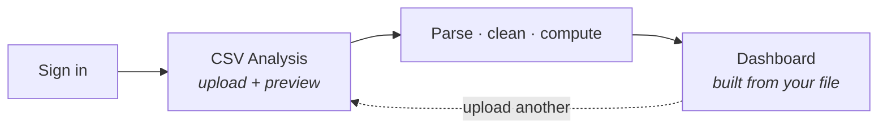
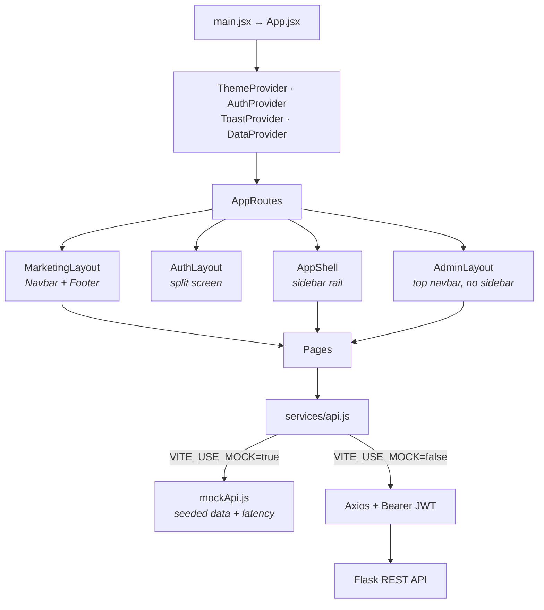

# InsightMart — Frontend

Sales Analytics & Reporting Platform. Upload a sales CSV and get revenue trends, top performers,
branch profitability, retention and an exportable PDF report.

This is the **React single-page frontend**. It talks to a Flask REST API over JSON with a JWT, and
ships with an in-browser mock backend so the whole application runs without Flask.

```bash
npm install
cp .env.example .env
npm run dev          # http://localhost:5173
```

Then sign in with any [demo account](#demo-accounts) — the login page lists them as one-click cards.

---

## Contents

- [Getting started](#getting-started)
- [Demo accounts](#demo-accounts)
- [The upload-first flow](#the-upload-first-flow)
- [Architecture](#architecture)
- [Routes and access](#routes-and-access)
- [Project structure](#project-structure)
- [Design system](#design-system)
- [Motion](#motion)
- [Connecting the Flask backend](#connecting-the-flask-backend)

---

## Getting started

**Requires Node 20 or newer.**

| Command | Does |
|---|---|
| `npm install` | Install dependencies |
| `npm run dev` | Vite dev server on port 5173 |
| `npm run build` | Production bundle into `dist/` |
| `npm run preview` | Serve the built bundle |

### Environment

`.env` holds two variables. Copy `.env.example` and leave the defaults to run against the mock.

| Variable | Default | Meaning |
|---|---|---|
| `VITE_API_BASE_URL` | `http://localhost:5000/api` | Base URL of the Flask REST API |
| `VITE_USE_MOCK` | `true` | When true, an in-browser mock serves every request |

---

## Demo accounts

The mock backend seeds four accounts, one per role. All share the password **`demo1234`**.

| Role | Email | What it unlocks |
|---|---|---|
| Individual | `individual@insightmart.dev` | CSV Analysis, Dashboard, My Account, Plans |
| Team lead | `enterprise@insightmart.dev` | The above, plus Organisation with management controls |
| Team member | `team@insightmart.dev` | The above, but the team roster is **read-only** |
| Admin | `admin@insightmart.dev` | Everything, plus the Admin console |

Sign in as **Individual** to see the Free-tier experience: the order-value histogram, retention chart
and branch profitability are locked behind an upgrade prompt, and PDF export is unavailable.

---

## The upload-first flow

Nothing exists until a CSV is analysed. Signing in lands on **CSV Analysis**, not the dashboard.



1. Drop a CSV. Papa Parse shows the detected columns and first rows **before** anything is sent.
2. "Run analysis" uploads it, then walks a staged sequence: validate → parse → clean → compute.
3. On success the analysis is stored in `DataContext` and you land on the Dashboard.
4. The Dashboard reads `hasData`. With no analysed file it shows an upload prompt instead of empty
   charts. The full breakdown stays on CSV Analysis whenever you go back.

---

## Architecture

Three layout shells, one service gateway. Components never import Axios.



### The three shells

| Shell | Used by | Chrome |
|---|---|---|
| `MarketingLayout` | Home, Plans | Floating navbar that condenses on scroll, footer |
| `AuthLayout` | Login, Register | Split screen: form left, animated brand panel right |
| `AppShell` | Dashboard, CSV Analysis, Organisation, My Account | Collapsible sidebar rail + slim top bar |
| `AdminLayout` | Admin console | **Top navbar, no sidebar** — deliberately a separate surface |

### Page transitions

Each layout owns its own transition via `RouteTransition`, which wraps only its `<Outlet/>`:

```jsx
<AnimatePresence mode="wait" initial={false}>
  <Outlet key={location.pathname} />
</AnimatePresence>
```

The layout stays mounted across navigation, so sidebar state and fetched layout data survive.
Keying the whole `<Routes>` element instead would remount the shell on every click **and stall
browser back/forward** — that was a real bug, fixed by scoping the key to the outlet.

### Contexts

| Context | Holds |
|---|---|
| `AuthContext` | User, JWT, role, plan, and the derived permissions pages gate on |
| `DataContext` | The analysis from the most recent upload, and `hasData` |
| `ThemeContext` | `dark` / `light` / `system`, resolved before first paint |
| `ToastContext` | Animated notification queue |

---

## Routes and access

| Route | Page | Individual | Team lead | Team member | Admin |
|---|---|:--:|:--:|:--:|:--:|
| `/` | Home | ✓ | ✓ | ✓ | ✓ |
| `/plans` | Plans | ✓ | ✓ | ✓ | ✓ |
| `/login` `/register` | Authentication | ✓ | ✓ | ✓ | ✓ |
| `/analysis` | CSV Analysis | ✓ | ✓ | ✓ | ✓ |
| `/dashboard` | Dashboard | ✓ | ✓ | ✓ | ✓ |
| `/account` | My Account | ✓ | ✓ | ✓ | ✓ |
| `/organisation` | Organisation | — | ✓ manage | ✓ read-only | ✓ |
| `/admin` | Console overview | — | — | — | ✓ |
| `/admin/users` | Users — edit, suspend, delete | — | — | — | ✓ |
| `/admin/organisations` | Organisations — delete | — | — | — | ✓ |
| `/admin/uploads` | Uploads & data — delete | — | — | — | ✓ |

`ProtectedRoute` sends an unauthenticated visitor to `/login` with the attempted path remembered, so
signing in returns them where they were headed. A signed-in user without the required role goes to
`/analysis` instead — they are authenticated, just not permitted there.

Role gating here is for **navigation only**. The API re-enforces it.

### Organisation: lead vs member

The same page renders two ways. A team lead gets invite, role-change and remove controls plus the
seat meter. A team member sees the identical roster marked *Read only*, with a note to ask their
lead for changes.

---

## Project structure

```
src/
├── main.jsx  App.jsx              entry and provider tree
├── styles/index.css               design tokens, glass/rim primitives, utilities
├── lib/
│   ├── cn.js                      class merge helper
│   ├── motion.js                  easings, springs, shared variants
│   ├── formatters.js              currency, compact numbers, percent, dates
│   └── constants.js               roles, nav, plans, plan matrix
├── hooks/                         useCountUp, useTilt, useMediaQuery,
│                                  useLocalStorage, useOnClickOutside
├── context/                       Auth, Data, Theme, Toast
├── services/
│   ├── api.js                     the single gateway (Axios + mock switch)
│   └── mock/
│       ├── mockData.js            seeded dataset — 260 sales records, users, orgs
│       └── mockApi.js             latency-simulated resolver per endpoint
├── routes/AppRoutes.jsx           route table
├── components/
│   ├── Navbar  Sidebar  KpiCard  ChartCard  ProtectedRoute
│   ├── TeamMembers.jsx            org roster, lead and member variants
│   ├── ConfirmDialog.jsx          blocking confirm for destructive admin actions
│   ├── home/                      Hero, HeroMockup, FeatureBento, HowItWorks,
│   │                              StatsBand, LogoMarquee
│   ├── layout/                    MarketingLayout, AuthLayout, AppShell,
│   │                              AdminLayout, RouteTransition, Footer, ScrollToTop
│   ├── motion/                    Reveal, Stagger, Spotlight, MagneticButton,
│   │                              AuroraBackground, GridBackdrop, PageTransition, CountUp
│   ├── charts/                    RevenueLineChart, SalesBarChart, CategoryDonut,
│   │                              OrderHistogram, RetentionChart, Sparkline, chartTheme
│   └── ui/                        Button, Card, Badge, Input, Select, Tabs, Table,
│                                  Modal, Skeleton, Progress, EmptyState, FileDropzone,
│                                  ThemeToggle, Logo
└── pages/
    ├── Home  Login  Register  Plans  Dashboard
    ├── CsvAnalysis  Organisation  MyAccount  NotFound
    └── admin/                     AdminOverview, AdminUsers,
                                   AdminOrganisations, AdminUploads, AdminSection
```

---

## Design system

Defined once in `styles/index.css` and `tailwind.config.js`, then composed everywhere.

**Colour** — CSS custom properties holding raw RGB channels on `:root`, overridden under
`[data-theme="dark"]`. Tailwind consumes them through a wrapper so opacity modifiers
(`bg-surface/60`) still work and every surface themes for free. A boot script in `index.html`
resolves the stored preference before first paint, so nothing flashes.

| Token group | Purpose |
|---|---|
| `canvas` `surface` `elevated` `sunken` | Background depth layers |
| `ink` `muted` `faint` | Text hierarchy |
| `brand` `violet` `cyan` | Accent ramp — CTAs, chart strokes, focus rings |
| `success` `warn` `danger` | KPI deltas, statuses, validation, margin badges |
| `hairline` | All borders and dividers, applied at low alpha |

**Type** — Sora for display headings, Inter for UI, JetBrains Mono for identifiers. Headings use a
fluid `clamp()` scale. Every figure uses tabular numerals so digits do not jitter while counting up.

**Surfaces** — `.glass` for the frosted panels, `.rim` for the 1px light-catching gradient border,
`.text-gradient` for the animated brand headline.

Charts read their palette from the same tokens via `components/charts/chartTheme.js`, so they
re-theme with the rest of the app. All four documented chart types are covered: bar, line,
histogram and donut, plus a stacked area for retention and inline sparklines.

---

## Motion

| Behaviour | Where |
|---|---|
| Route transition — fade and rise | Every page change, per layout |
| Scroll reveal and stagger | Marketing sections, cards, table rows |
| Shared-layout indicator | Sidebar pill, admin navbar pill, tabs, segmented controls |
| Count-up figures | KPI cards, stats band, admin tiles |
| Self-drawing SVG paths | Hero mockup, auth panel chart |
| Cursor parallax and spotlight | Hero product window, feature and KPI cards |
| Magnetic buttons | Primary calls to action |
| Staged progress | CSV upload: validate → parse → clean → compute |

Every animated component checks `prefers-reduced-motion`. When set, decorative motion is removed,
parallax stops, and count-up figures snap to their final values. Nothing becomes unusable and no
information is lost.

The interface contains **no emoji** — all icons are `lucide-react`.

---

## Connecting the Flask backend

1. Start Flask with CORS enabled for the Vite origin.
2. Set `VITE_USE_MOCK=false` in `.env` and point `VITE_API_BASE_URL` at the Flask host.
3. Restart the dev server.

No component or page changes — only `services/api.js` resolves differently. The endpoints it expects:

| Group | Functions | Endpoint |
|---|---|---|
| `authApi` | login, register, forgotPassword, logout | `/auth/*` |
| `accountApi` | getProfile, updateProfile, changePassword, changePlan | `/account/*` |
| `dashboardApi` | get | `/dashboard` |
| `analysisApi` | get, listUploads, upload, exportReport | `/analysis/*` |
| `organisationApi` | get, invite, updateRole, remove | `/organisation/*` |
| `adminApi` | overview, updateUser, setUserStatus, deleteUser, deleteOrganisation, deleteUpload | `/admin/*` |

---

## Tech stack

React 18 · Vite 5 · React Router 6 · Axios · Recharts · React Hook Form · Tailwind CSS 3 ·
Framer Motion · Lucide · Papa Parse

The backend lives in [`backend/`](./backend). Full system documentation, including the end-to-end
data flow and page-by-page breakdown, is in
[`InsightMart_Frontend_Documentation.pdf`](./InsightMart_Frontend_Documentation.pdf).
