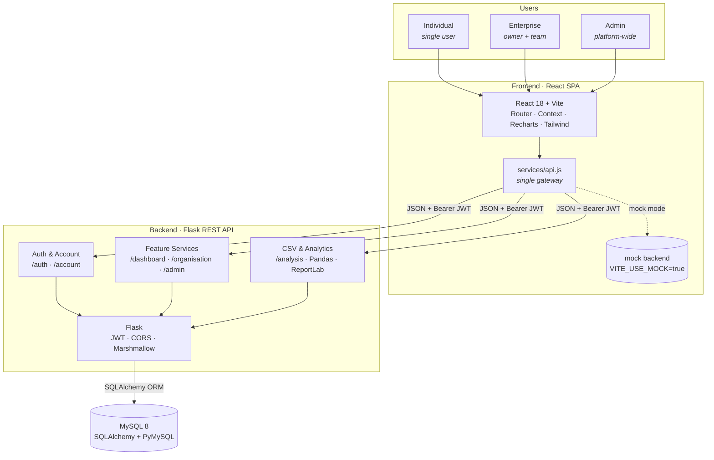
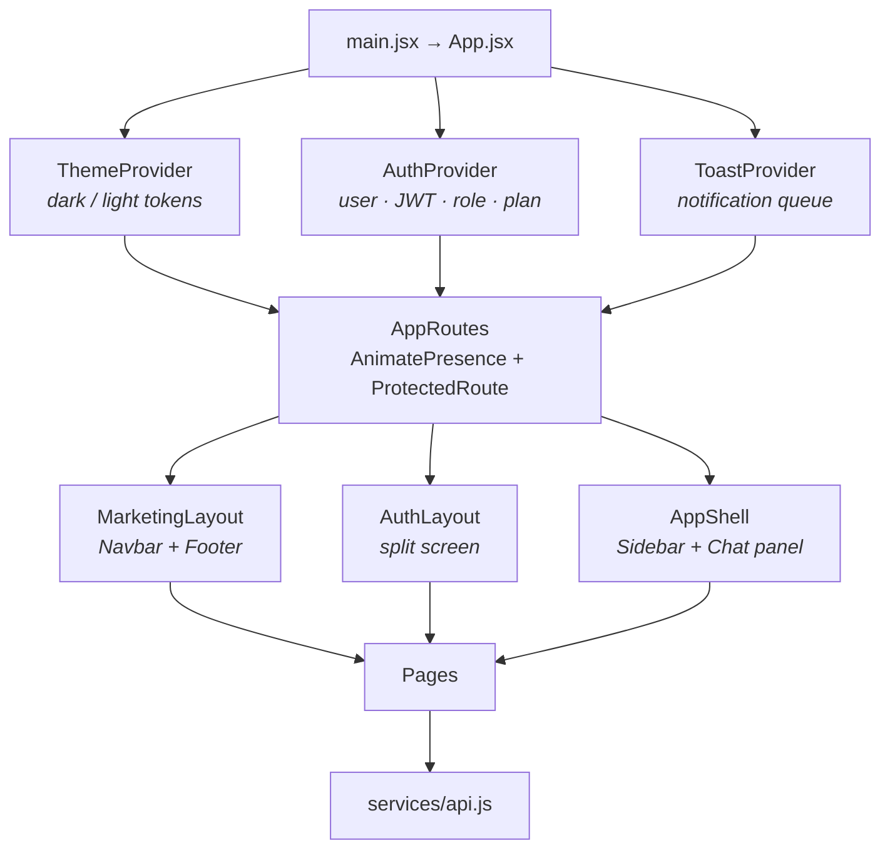
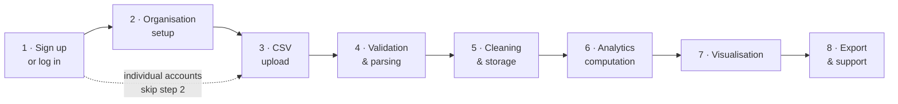
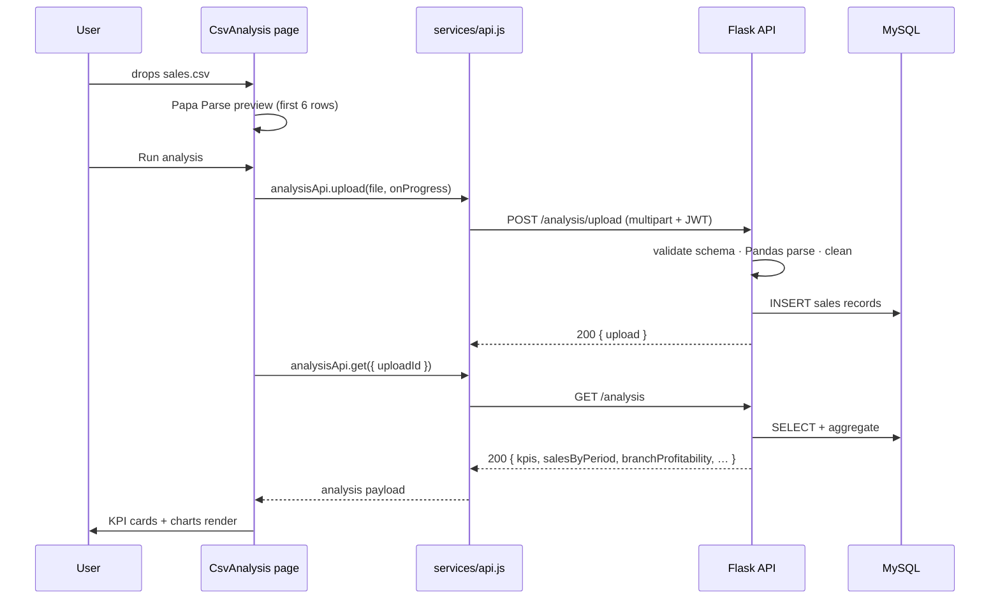
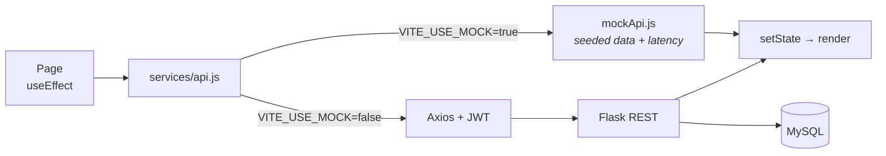

# InsightMart

Sales Analytics & Reporting Platform — upload a sales CSV and get revenue trends, top performers,
branch profitability, retention and an exportable PDF report.

A decoupled application: a **React** single-page frontend, a **Flask** REST API, and a **MySQL**
database. This repository holds the frontend.

---

## System Architecture

Three classes of user reach the same React application. It calls one Flask REST API over JSON with a
JWT, and that API owns all business logic and the only database connection.



### Boundaries

| Layer | Responsibility |
|---|---|
| **React SPA** | Presentation, routing and session state. Role gating here is for navigation only — the API re-enforces it. |
| **Service gateway** | The one place that talks HTTP. Components call named functions, never Axios directly. |
| **Flask REST API** | All business logic, validation, authentication and analytics. |
| **MySQL** | Reachable only through SQLAlchemy inside Flask. The frontend never touches it. |

### Frontend composition



---

## Data Flow

### End-to-end journey



| # | Stage | What happens |
|---|---|---|
| 1 | **Sign up / log in** | Register as Individual or Enterprise. Flask hashes the password and returns a JWT, which the auth context stores. |
| 2 | **Organisation setup** | Enterprise accounts create an organisation and invite team members. Individual accounts skip this entirely. |
| 3 | **CSV upload** | The user drops a sales file on the CSV Analysis page. Columns are previewed client-side before anything is sent. |
| 4 | **Validation & parsing** | Flask checks the file type and required columns, then reads it with Pandas. |
| 5 | **Cleaning & storage** | Missing values are handled, records are normalised, and rows are written to MySQL through SQLAlchemy. |
| 6 | **Analytics computation** | The analytics service computes revenue, top products and regions, profitability, retention and order metrics. |
| 7 | **Visualisation** | Dashboard and CSV Analysis render the results as KPI cards plus bar, line, histogram and donut charts. |
| 8 | **Export & support** | The user exports a ReportLab PDF or asks the chat sidebar for help. Admin oversees all of it at any point. |

### Upload request, end to end



### The gateway switch

Every call follows the same path. `services/api.js` decides at call time whether to reach Flask or
the in-browser mock, and both return the identical response shape.



This is why the whole frontend is reviewable before the backend exists. To connect the real API:

```bash
# .env
VITE_API_BASE_URL=http://localhost:5000/api
VITE_USE_MOCK=false
```

No component or page changes — only the gateway resolves differently.

---

## Routes and access

| Route | Page | Individual | Enterprise | Team | Admin |
|---|---|:--:|:--:|:--:|:--:|
| `/` | Home | ✓ | ✓ | ✓ | ✓ |
| `/plans` | Feature plans | ✓ | ✓ | ✓ | ✓ |
| `/login` `/register` | Authentication | ✓ | ✓ | ✓ | ✓ |
| `/dashboard` | Dashboard | ✓ | ✓ | ✓ | ✓ |
| `/analysis` | CSV Analysis | ✓ | ✓ | ✓ | ✓ |
| `/account` | My Account | ✓ | ✓ | ✓ | ✓ |
| `/organisation` | Organisation | — | ✓ | ✓ | ✓ |
| `/admin` | Admin | — | — | — | ✓ |

`ProtectedRoute` sends an unauthenticated visitor to `/login` with the attempted path remembered. A
signed-in user without the required role goes to `/dashboard` instead — they are authenticated, just
not permitted there.

---

## Getting started

```bash
npm install
cp .env.example .env
npm run dev          # http://localhost:5173
```

### Demo accounts

The mock backend seeds three accounts, one per role. All share the password **`demo1234`**, and they
are listed as one-click cards on the login page.

| Role | Email | Unlocks |
|---|---|---|
| Individual | `individual@insightmart.dev` | Dashboard, CSV Analysis, My Account, Plans |
| Enterprise | `enterprise@insightmart.dev` | The above, plus Organisation |
| Admin | `admin@insightmart.dev` | Everything, including Admin |

### Scripts

| Command | Does |
|---|---|
| `npm run dev` | Vite dev server on port 5173 |
| `npm run build` | Production bundle into `dist/` |
| `npm run preview` | Serve the built bundle |

---

## Tech stack

**Frontend** — React 18 · Vite 5 · React Router 6 · Axios · Recharts · React Hook Form ·
Tailwind CSS 3 · Framer Motion · Lucide · Papa Parse

**Backend** — Flask · Flask-SQLAlchemy · Flask-Migrate · Flask-JWT-Extended · Flask-CORS · Pandas ·
Marshmallow · ReportLab · Gunicorn

**Database** — MySQL 8 via PyMySQL

Full documentation, including the page-by-page breakdown and design system, is in
[`InsightMart_Frontend_Documentation.pdf`](./InsightMart_Frontend_Documentation.pdf).
